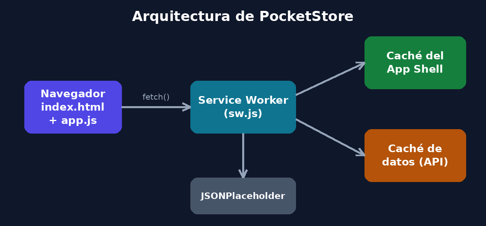
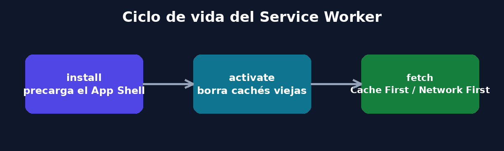
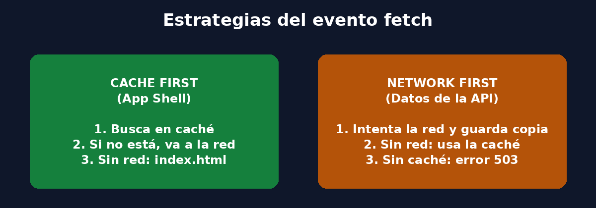
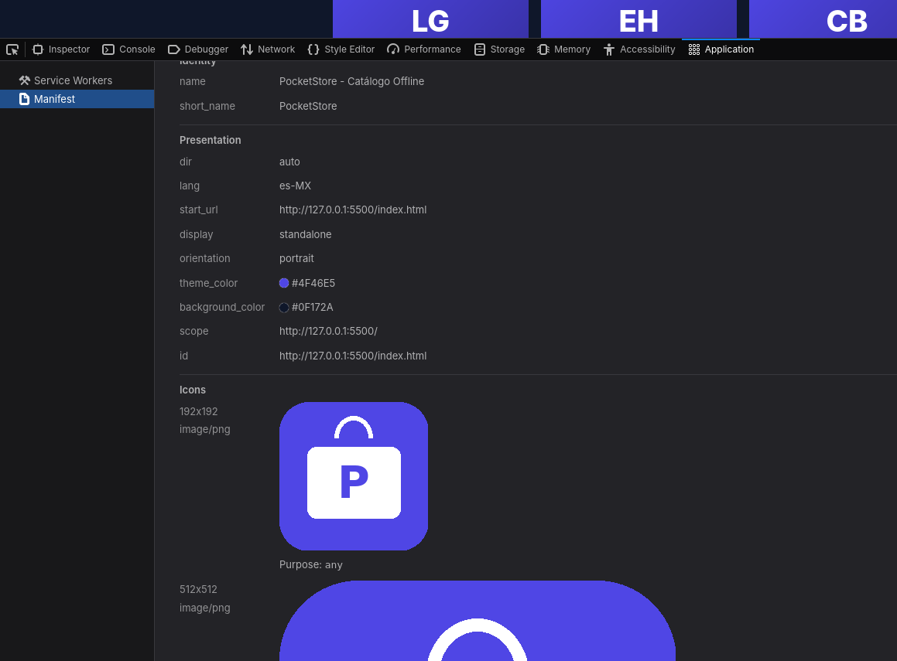
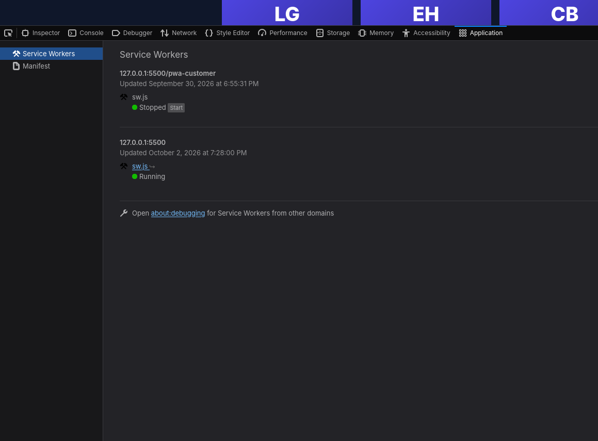
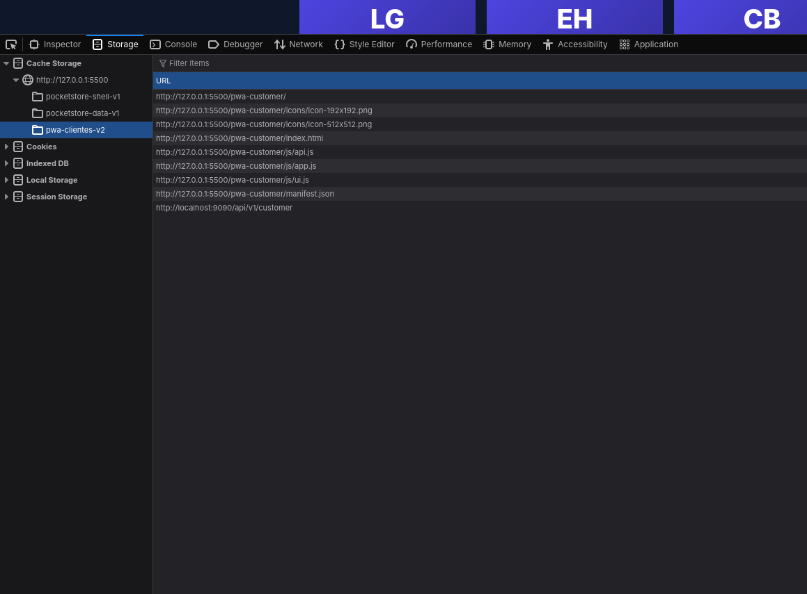
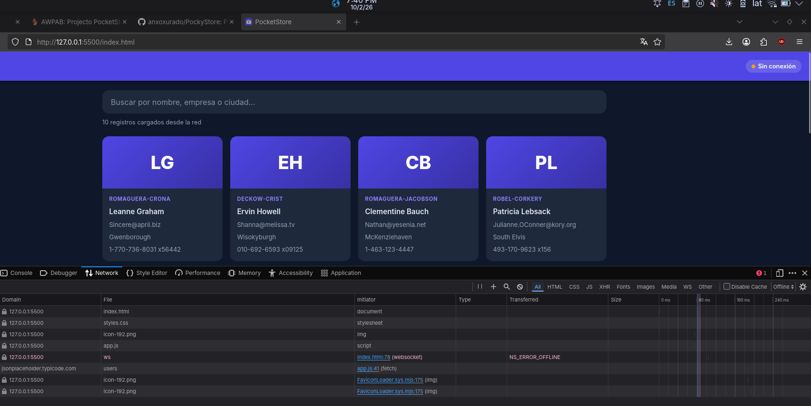

# PockyStore — Catálogo Offline con Vanilla JS

Aplicación Web Progresiva (PWA) de una sola página que lista elementos obtenidos de una API pública y funciona completamente sin conexión a internet. Está desarrollada con HTML, CSS y JavaScript puro, sin frameworks ni librerías.

- **Materia:** Aplicaciones Web Progresivas
- **Universidad:** Universidad Tecnológica de Chihuahua (UTCH)
- **Modalidad:** Desarrollo individual
- **API utilizada:** [JSONPlaceholder](https://jsonplaceholder.typicode.com/) — recurso `/users`

---

## Estructura del proyecto

```
/pocket-store
│
├── index.html         # Vista (App Shell)
├── styles.css         # Estilos del App Shell
├── app.js             # Lógica de la aplicación y registro del SW
├── sw.js              # Controlador (Service Worker y Caché)
├── manifest.json      # Configuración de instalación (Manifiesto)
├── icons/             # Iconos de la app (192x192, 512x512 y maskable)
└── docs/img/          # Imágenes que ilustran el proceso de desarrollo
```

---

## Proceso de desarrollo

### 1. El Manifiesto (`manifest.json`)

Se creó a mano el archivo JSON con:

| Propiedad | Valor |
|---|---|
| `name` | PockyStore - Catálogo Offline |
| `short_name` | PockyStore |
| `start_url` | `./index.html` |
| `display` | `standalone` |
| `theme_color` | `#4f46e5` |
| `background_color` | `#0f172a` |
| `icons` | 192x192, 512x512 y 512x512 *maskable* |

Se usan rutas relativas (`./`) para que la app funcione tanto en un dominio raíz como en un subdirectorio de GitHub Pages.

### 2. El App Shell (`index.html` y `styles.css`)

Se diseñó la estructura estática que carga al instante:

- **Barra superior** con el logo, el título y un indicador de conexión (En línea / Sin conexión).
- **Contenedor principal** con buscador y la cuadrícula del catálogo. Mientras llegan los datos se muestran *esqueletos de carga*, por lo que la vista nunca aparece vacía.
- **Pie de página** fijo.

El diseño es responsivo y usa CSS para los colores corporativos.

### 3. El Service Worker y la Caché (`sw.js`)

Se programó el ciclo de vida completo:

| Evento | Responsabilidad |
|---|---|
| `install` | Precarga todos los archivos del App Shell en `pocketstore-shell-v1` y llama a `skipWaiting()`. |
| `activate` | Elimina cachés de versiones anteriores y toma control con `clients.claim()`. |
| `fetch` | Intercepta las peticiones y aplica una estrategia según el tipo de recurso. |

Estrategias implementadas en el evento `fetch`:

- **Cache First** para los archivos propios (App Shell): se responde desde caché y solo se va a la red si el archivo no existe. Si no hay red en una navegación, se devuelve `index.html`.
- **Network First** para la API: se intenta la red y se guarda una copia en `pocketstore-data-v1`; si falla la conexión, se responde con la última copia guardada.

Cuando la respuesta proviene de la caché, el Service Worker añade la cabecera `X-Served-By`, lo que permite a la interfaz informar al usuario el origen de los datos.

### 4. El Contenido Dinámico (`app.js`)

- Registra el Service Worker al cargar la página.
- Consume `https://jsonplaceholder.typicode.com/users` con `fetch()` y `async/await`.
- Renderiza una tarjeta por registro (nombre, empresa, correo, ciudad y teléfono), escapando el HTML para evitar inyección de código.
- Incluye búsqueda en vivo por nombre, usuario, empresa o ciudad.
- Detecta los eventos `online` / `offline` para actualizar el indicador y recargar datos al recuperar conexión.

---

## Imágenes del proceso

Arquitectura general:



Ciclo de vida del Service Worker:



Estrategias de caché del evento `fetch`:



> **Capturas de pantalla de la ejecución** :
>
> 
> 
> 
> 

---

## ▶Cómo ejecutar el proyecto

Los Service Workers requieren `https://` o `http://localhost`, por lo que **no funcionan abriendo el archivo con doble clic** (`file://`).

```bash
# Opción 1: Python
python -m http.server 8080

# Opción 2: Node.js
npx serve .

# Opción 3: Live server

```


Después abre `http://localhost:8080`.


## Cómo probar el funcionamiento offline

1. Abre la app con conexión y espera a que cargue el catálogo.
2. En DevTools ve a **Application → Service Workers** y confirma que está *activated and running*.
3. En **Application → Cache Storage** verifica las cachés `pocketstore-shell-v1` y `pocketstore-data-v1`.
4. Activa la casilla **Offline** (pestaña *Service Workers*) o la opción *Offline* en *Network*.
5. Recarga la página: el App Shell y el catálogo siguen disponibles y el indicador muestra **Sin conexión**.
6. En **Application → Manifest** puedes comprobar la configuración y usar el botón de instalación del navegador.
---

## Tecnologías

HTML5 · CSS3 · JavaScript · Service Worker API · Cache API · Fetch API · Web App Manifest

## Autor

Angel Gael Jurado Rodríguez — Grupo IDGS101N, Universidad Tecnológica de Chihuahua
